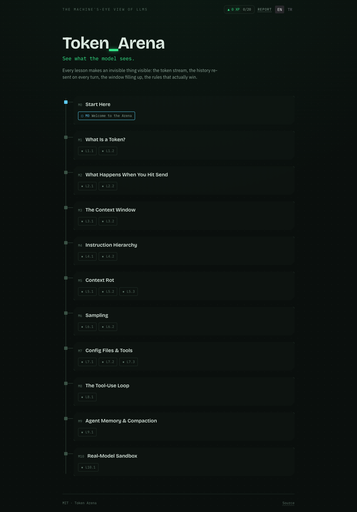
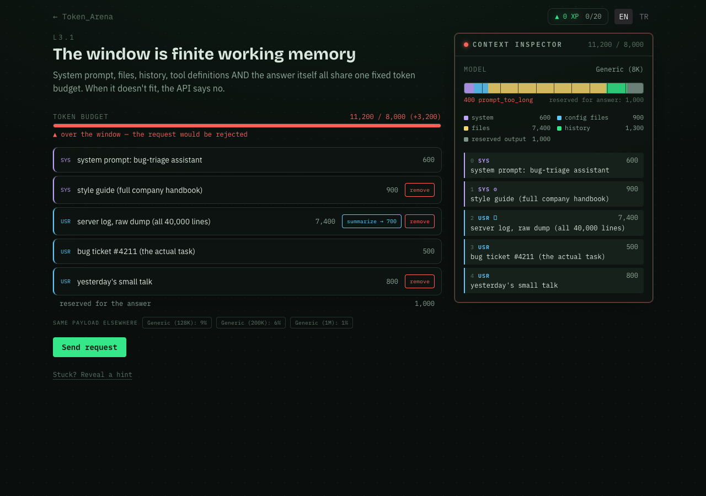
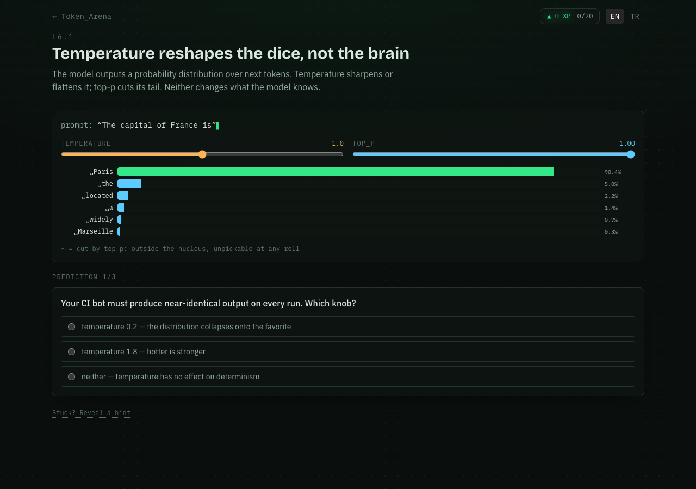

# Token Arena

**See what the model sees.** A gamified, open-source, fully static web app that teaches software developers how LLMs actually work — tokenization, the stateless request loop, the context window, instruction hierarchy, context rot, sampling, config files, the tool loop, and agent compaction. Real mechanics under a game, in the spirit of [Oh My Git!](https://ohmygit.org).

**Play it:** https://thornaci.github.io/token-arena — English and Turkish, no backend, no accounts, no telemetry. Progress lives in your browser.



## What's inside

- **11 modules, 20 lessons** — from "what is a token" to a real-API capstone. Every scripted lesson is deterministic and its authored numbers are locked to reality by tests.
- **The Context Inspector** — the signature panel. It shows the exact payload the model would receive on the next turn: every block, every token count, the fill bar, the simulated `400: prompt too long`.
- **A real model in your browser (L6.2)** — Qwen2.5-0.5B-Instruct via [transformers.js](https://github.com/huggingface/transformers.js) on WebGPU, one-time size-consented download, manual forward pass exposing true softmax top-k. No WebGPU? The lesson replays recorded runs of the same model with the identical UI.
- **BYO-key sandbox (M10)** — the only place real API calls happen, with your own key, straight from your browser to OpenAI / Anthropic / any OpenAI-compatible endpoint. The inspector mirrors the exact request body live.
- **Badges, XP, hints, share card** — completion report with a locally-rendered PNG. Progress export/import as JSON.

| The window filling up | Real sampling math |
| --- | --- |
|  |  |

## Quickstart

```sh
npm ci
npm run dev      # compiles i18n, starts the dev server
npm test         # 154 unit + data-reality tests
npm run build    # static production build (GitHub Pages ready)
npm run preview  # preview the production build
```

Requires Node ≥ 22.

## Architecture in six lines

- **Astro 7** static site (base `/token-arena`), **React 19** islands for the interactive parts, **Tailwind 4** design tokens.
- **Lessons are data, not code**: JSON in `src/content/lessons/**`, validated by a zod schema that also checks every referenced i18n key exists and that pass criteria line up with the authored content.
- **Mechanics are components**: `src/components/mechanics/*` registered in `src/components/sim/registry.ts`; a new lesson usually needs zero new code.
- **Engines are pure TypeScript**: tokenizer wrapper, context/billing/sampling/scoring/sim-step machines in `src/engine/` — all unit-tested in Node.
- **Determinism rule**: scripted lessons use authored `fixedTokens` only; live tokenization exists only in playground surfaces. Data tests recompute authored answers against the real engines.
- **i18n**: flat catalogs in `messages/{en,tr}.json` via Paraglide; CI fails if locales drift apart.

## Contributing

New lessons, new locales, and new mechanics are all designed to arrive as PRs — see [CONTRIBUTING.md](CONTRIBUTING.md) for the full walkthrough (including the schema reference and the "add a lesson without writing code" path).

## License

[MIT](LICENSE)
